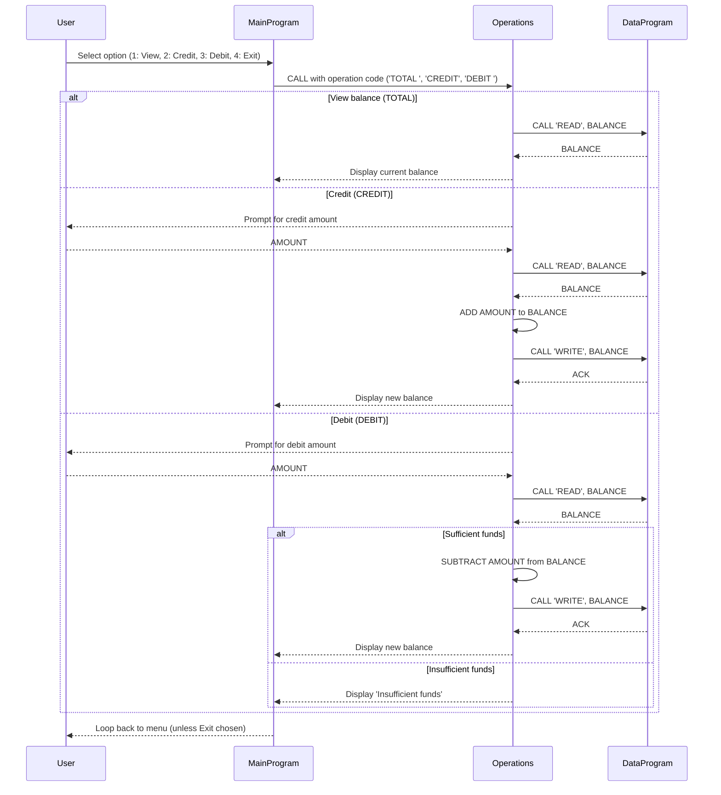

COBOL Account Management — Documentation

Overview
- Simple CLI account management implementation in COBOL (menu-driven).
- Three source programs: `MainProgram` (menu/flow), `Operations` (business operations), `DataProgram` (simple in-memory storage).

Files

- `src/cobol/main.cob`
  - Purpose: Program entry point and user interface. Displays a menu and accepts choices (1-4).
  - Key routines/vars: `MAIN-LOGIC`, `USER-CHOICE` (PIC 9), `CONTINUE-FLAG` (controls loop).
  - Calls `Operations` with operation codes: `TOTAL `, `CREDIT`, `DEBIT `, or exits.

- `src/cobol/operations.cob`
  - Purpose: Implements account operations called from `MainProgram`.
  - Key routines/vars: `Operations` (PROGRAM-ID), `OPERATION-TYPE`, `AMOUNT` (PIC 9(6)V99), `FINAL-BALANCE`.
  - Behavior:
    - `TOTAL `: Calls `DataProgram` USING `READ` to obtain current balance and displays it.
    - `CREDIT`: Prompts for amount, reads current balance, adds amount, writes updated balance via `DataProgram` USING `WRITE`.
    - `DEBIT `: Prompts for amount, reads current balance, if `FINAL-BALANCE >= AMOUNT` then subtracts and writes back; otherwise displays "Insufficient funds".
  - Notes: Operation codes are 6-character fields; some codes include trailing spaces (e.g. `TOTAL `, `DEBIT `).

- `src/cobol/data.cob`
  - Purpose: Minimal persistence/storage module for account balance.
  - Key routines/vars: `DataProgram` (PROGRAM-ID), `STORAGE-BALANCE` (WORKING-STORAGE PIC 9(6)V99, default 1000.00), `PROCEDURE DIVISION USING PASSED-OPERATION BALANCE`.
  - Behavior:
    - If passed-operation = `READ`, moves `STORAGE-BALANCE` into the passed `BALANCE` parameter.
    - If passed-operation = `WRITE`, moves value from passed `BALANCE` into `STORAGE-BALANCE`.

Key functions and interfaces
- `DataProgram` signature: PROCEDURE DIVISION USING PASSED-OPERATION BALANCE.
  - PASSED-OPERATION: 6-char operation command (`READ`/`WRITE` expected).
  - BALANCE: numeric PIC 9(6)V99 passed by reference.
- `Operations` is called with a single 6-char operation code and performs reads/writes through `DataProgram`.
- `MainProgram` collects user input and delegates to `Operations`.

Business rules (encoded in code)
- Initial balance: `STORAGE-BALANCE` defaults to 1000.00.
- Credits: any accepted amount is added to the balance.
- Debits: allowed only when `FINAL-BALANCE >= AMOUNT`; otherwise the debit is rejected with an "Insufficient funds" message.
- Amount format: monetary values use `PIC 9(6)V99` (up to 6 integer digits and 2 decimals).
- Input validation: minimal — user-entered amounts and menu choices are not robustly validated in the code.
- Operation codes: fixed-width 6-character strings; mismatched spacing will alter behavior (e.g., `DEBIT ` vs `DEBIT`).

Student-account specific rules
- There are no student-specific rules present in the current source files (no student identifiers, enrollment state, or student-specific limits).
- Relevant general account rules that would affect student accounts:
  - No overdraft allowed (debits blocked when insufficient funds).
  - Default starting balance is 1000.00 (this may be a placeholder; confirm with business owners).
  - No per-account identification or multiple accounts are implemented — the system manages a single in-memory balance.

Recommendations for student-account features (suggested additions)
- Add account identifiers (student ID) and a table of balances to support multiple student accounts.
- Add authentication/authorization before allowing credit/debit operations.
- Add input validation for numeric ranges and non-negative amounts.
- Add transaction logging/audit trail (date, student ID, operation, amount, result).
- Define policy for minimum balance, overdraft limits, and permitted payment types for student accounts.

Notes for maintainers
- The `DataProgram` currently uses in-memory `WORKING-STORAGE` for balance; it will not persist across runs. Replace with file or DB storage for real data.
- Watch for exact string matches on operation codes (6-char fields). Trim/pad consistently when changing callers.

Contact
- If you want, I can update the code to add per-student accounts, basic validation, and persistence. Just tell me which changes to prioritize.

**Sequence Diagram**

The following Mermaid sequence diagram shows the data flow between the user-facing `MainProgram`, the `Operations` module, and the `DataProgram` storage module.

